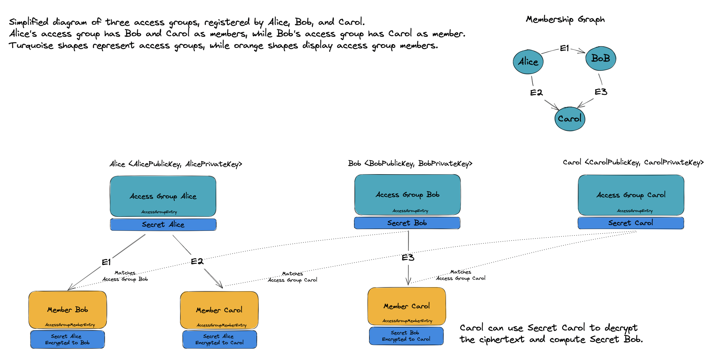
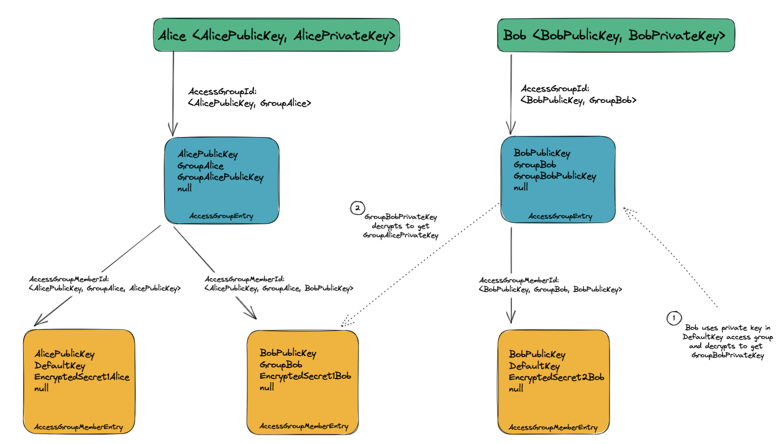

# Access Group and New Message Technical Report


## Dynamic Multiparty Key Exchange with Implementation to Group Messaging

------------


## Introduction

This document details the design and purpose of three new transactions: `"ACCESS_GROUP,"` `"ACCESS_GROUP_MEMBERS,"` and `"NEW_MESSAGE,"` that were added to the DeSo Core during the [v3.1.0 release](https://github.com/deso-protocol/core/releases/tag/v3.1.0). Access groups enable secure on-chain multiparty key exchange. Our access groups framework is non-interactive, with a single key pair responsible for all group operations[^1]. The member set can be dynamically adjusted, allowing the creation of large groups where access can be frequently granted or revoked. The framework has a storage complexity of O(**n**) to support **n**-party key exchange and an O(1) online running time for adding or removing a single member[^2]. Additionally, removing a single member with a key rotation incurs an O(log(**n**)) running time[^3]. Further, the new transactions enable a more efficient private direct messaging (DM) and introduce private group chat messaging (GC), leveraging access groups for GC membership management. Sending a message to both DM and GC threads incurs an O(1) running time and O(**l**) storage complexity, where **l** is the length of the message sent.


## Motivation

Access groups came to be due to our efforts to implement E2EE group chats on DeSo. Before the v3.1.0 release, DeSo supported direct messaging secured by the cryptographic identities of the participants[^4]. As we approached group chats, we realized that the cryptography used in the 2-party messaging was not adaptable to the multiparty case[^5]. Consequently, a new approach was needed altogether.

Analyzing the problem of implementing group chats, one of the fundamental requirements of a solution is storing message threads containing E2EE message records. A natural solution is to encrypt all messages within a group chat with a single secret key known only by the group members. The secret can then be obfuscated so it can be stored safely on the public DeSo state machine. The public information would reveal the secret to all group members, yet it would appear indistinguishable from random data to an outsider. Such a protocol is known in the literature as a multiparty key exchange over an insecure communication channel[^6]. However, in the case of group chats, it would be convenient to have the ability to inexpensively adjust the key exchange party set so that the group chat moderators can add or remove users dynamically. Studying the literature, we could not find a low-complexity multiparty key exchange solution offering efficient adjustments to the party size under operations such as key rotation. As a result, we designed access groups. It is worth noting that access groups are decoupled from group chats. Access groups implement a self-contained multiparty key exchange scheme,  portable to other useful features such as member-only private content, or on-chain derived key[^7] private distribution. Group chats use access groups as a dependency. To summarize, our implementation of group chats consists of two main components:


1. Group membership management and secret key exchange (Access Groups)
2. Storage and indexing of encrypted messages (New Message)


## Access Groups

Access groups combine a low-complexity multiparty key exchange scheme with a flexible graph-like data structure. Every DeSo user is uniquely identified by their public key, and their private key is used to create proofs of this identity through digital signatures. In access groups, users’ <public key, private key> pairs are used for public-key encryption via ECIES[^8]. To create an access group, the group owner will first generate a secret and register the secret’s public key on the blockchain. To add members to the access group, the group owner (or a moderator) retrieves the group’s secret and encrypts it to each new member. The encrypted keys are then added to the DeSo state, and they’ll reveal the secret key to all members, who hold decryption keys, yet will appear indistinguishable from a random string to every non-member[^9].

For each access group, the DeSo blockchain stores a metadata record (<strong><code>AccessGroupEntry</code></strong>) and a collection of member records (<strong><code>AccessGroupMemberEntry</code></strong>), holding encrypted key shares for all members participating in the access group. Access group member records point to an existing, registered access group of the member, and the encrypted secret is addressed to the member’s access group. Structurally, we can think of metadata records as vertices in a graph of all access groups. Then, member records represent directed edges between different vertices in this graph. If we look at <strong>Diagram 1.</strong> we can see an example of three access groups registered by users Alice, Bob, and Carol. Alice’s group has Bob and Carol as members. Consequently, Alice’s group stores a metadata record and two member records holding Alice’s secret encrypted to Bob and Carol. Bob’s group has Carol as member, so it stores one metadata record and one member record. The result of these membership relations is a graph with three directed edges Alice -> Bob, Alice -> Carol, Bob -> Carol.

In the following sections, we will discuss the implementation details of access group and access group member objects and corresponding state transactions.





<strong>Diagram 1.</strong> Simplified overview of three access groups created by Alice, Bob, and Carol.

<br></br>

### Data Layer

This section will analyze what’s stored in the state with each access group transaction. An access group comprises an <strong><code>AccessGroupEntry</code></strong> object containing information about the group, and a collection of <strong><code>AccessGroupMemberEntry</code></strong> objects containing encrypted key share records of each member. The objects are defined as follows:


```
AccessGroupEntry
{
   AccessGroupOwnerPublicKey [33]byte             // User's public key
   AccessGroupKeyName        [32]byte             // Group's name
   AccessGroupPublicKey      [33]byte             // Public key shared
   ExtraData                 map[string][]byte    // Custom KV data
}
```


Users can create access groups by signing and broadcasting `"ACCESS_GROUP"` transactions. When executed, these transactions will write the `AccessGroupEntry` records to the blockchain state. Looking at the individual fields of this entry:


* `AccessGroupOwnerPublicKey` field is the public key of the transactor who registered the group.
* `AccessGroupKeyName` is the 32-character access group secondary identifier[^10]. Our choice of 32 characters identifier length was motivated by the matching output length of a sha256 hash function. We add a constraint in the transaction validation logic that allows only a single `<AccessGroupOwnerPublicKey, AccessGroupKeyName>` to be registered at a time. This pair is referred to as _AccessGroupId_, and we will describe it in the following section.


* `AccessGroupPublicKey` is the public key of the secret shared within this group on secp256k1 curve.
* `ExtraData` field allows storing any key-value data associated with the access group.

It is worth noting that `AccessGroupEntry` doesn’t store any private key material. Private key copies will instead be stored encrypted in the member entries.


#### AccessGroupId

Each access group is uniquely identified by an *AccessGroupId* equal to the pair `<AccessGroupOwnerPublicKey, AccessGroupKeyName>`. We will sometimes shorthand this pair by e.g. saying “*UserAccessGroupId*” for better readability.


#### AccessGroupMemberEntry


```
{
   AccessGroupMemberPublicKey [33]byte             // Member's public key
   AccessGroupMemberKeyName   [32]byte             // Member's group key name
   EncryptedKey               []byte               // Secret encrypted to member's group
   ExtraData                  map[string][]byte    // Custom KV data
}
```


Users can add access group members by signing and broadcasting `"ACCESS_GROUP_MEMBERS"` transactions. When executed, these transactions will write the `AccessGroupMemberEntry` records to the blockchains state. Looking at the fields of this struct:


* `AccessGroupMemberPublicKey` is the public key of the member user of this group.
* `AccessGroupMemberKeyName`, is any 32-character group key name. Together these two fields form the *MemberAccessGroupId* of an access group belonging to the member user. As mentioned, member records can be considered as edges between access groups. The *AccessGroupId* is the source, and *MemberAccessGroupId* is the destination of this edge. A restriction currently applies in the DeSo Core where *MemberAccessGroupId* cannot equal the group’s *AccessGroupId*; this invalidates loop edges.
* `EncryptedKey` field contains the encrypted group secret share. The recipient of this encryption is the `AccessGroupPublicKey` stored in the access group identified by *MemberAccessGroupId*. The access group member can use the corresponding secret stored within the *MemberAccessGroupId* group to decrypt the `EncryptedKey`. This design choice leads to various interesting properties, such as allowing an access group of users to immediately gain access to another access group with an overhead of just a single `AccessGroupMemberEntry` added to the state. As we’ll later see, this can be further used to facilitate an efficient key rotation in an access group.
* `ExtraData` field allows storing any key-value data associated with the access group member.


#### AccessGroupMemberId

Similarly to `AccessGroupEntry` objects, the member entries can be assigned an identifier. Each `AccessGroupMemberEntry` object is uniquely identified by an *AccessGroupMemberId* consisting of
`<AccessGroupOwnerPublicKey, AccessGroupKeyName, AccessGroupMemberPublicKey>`.





**Diagram 2.** A visual representation of the relationship between access group and access group member objects


### Base Key

The base key is a particular access group pre-defined for every user. This access group is never stored as part of the DeSo state; however, it exists for the purpose of transaction validation. The group is identified by the id of `<UserPublicKey, null>` where null is an array consisting of 32 byte(0) characters. The base key represents the user’s key pair. In particular, `AccessGroupOwnerPublicKey `and `AccessGroupPublicKey `are the same and equal to the `UserPublicKey` in the base key access group. Since access groups are used for key exchange to mitigate key leakage, the base key cannot have any `AccessGroupMemberEntries` registered.


### Standards

The access group framework is open for community-defined transaction standards. These standards could include encryption schemes, special keys in the `ExtraData,` or special members in access groups. These standards won’t be part of the canonical transaction validation logic in DeSo Core (at least initially) and instead will live in the application layer where Backend or Frontend software can interpret the data accordingly. We suggest two such standards: one related to encryption, and one, which we call the “Default Key Standard,” related to access groups.


#### `EncryptedKey` Standard

It is worth noting that to this point, we haven’t mentioned what exactly is stored in the `EncryptedKey` field of the access group member entries. That’s because DeSo core applies no limitations on this field, and it’s up to the application layer to correctly compute these values.

`EncryptedKey: `Our suggested approach to securing the access group’s secret for members is to encrypt the group’s secret using an ECIES scheme. We recommend the combination of AES-128-CTR, Concatenation KDF based on SHA256, and HMAC based on SHA256. DeSo blockchain uses secp256k1 elliptic curve and we recommend the same curve in ECIES[^11]. The process of encrypting access group’s secret to members is exemplified in **Diagram 2.** There, Alice’s group secret, the *GroupAlicePrivateKey*, is encrypted to the public key stored in Bob’s access group, *GroupBobPublicKey*. The ciphertext is then stored as *EncryptedSecretBob1* in a member entry in Alice’s group. Given the knowledge of *GroupBobPrivateKey* (2), Bob can then decrypt the ciphertext to get the secret *GroupAlicePrivateKey.*

Anytime the `EncryptedKey` field is decrypted by a member, it must be verified that the decrypted secret matches the `AccessGroupPublicKey` as specified in the access group entry. If the secret doesn’t match, the group should be ignored. Sometimes, the `EncryptedKey` field might not need decryption. In the case of public group chats, no encryption is needed, yet access groups are used for membership management. In such a case, the `EncryptedKey` can be left empty, and appropriate `ExtraData` keys should be set.


#### Default Key Standard

Default Key Standard, **DKS**, introduces default key pairs which are intended to work like the user's second key pair. The default key is a particular access group that replaces the user’s owner key pair in all access group-related encryption. First, we define a key derivation function[^12]:

```
groupPrivateKey(privateKey [32]byte, keyName [32]byte, version uint) := 
   sha256x2(sha256x2(privateKey) || sha256x2(keyName) || sha256x2(version))
```

The main advantage of this function is that it is a deterministic one-way function seeded by a couple of useful parameters. Moreover, this key derivation does not suffer from Privilege Escalation Attacks[^13], so the knowledge of an individual output key does not reveal other keys.

<span style="text-decoration:underline;">This standard requests applications build atop of DeSo to:</span>


1. For each new user, create a special <strong><code>AccessGroupEntry</code></strong> with an identifier of <strong><code><UserPublicKey, "default-key"></code></strong>[^14] where the ASCII key name is padded to 32 bytes with a suffix of byte(0) characters. The derived key can be generated by computing `defaultKeyAccessGroupPrivateKey = groupPrivateKey(user’s private key, wrap(“default-key”)`[^15], version), with the version beginning from 0 and incrementing with any key rotation. Records can be set in access group entry `ExtraData` for key-value pairs `{"derivation": "deso-kdf"}` to indicate how private key was derived, and `{"version": 0}` to track group version.


2. Whenever generating an access group, use the default key as input to a deterministic key derivation to compute the group secret. If the default key is unavailable, generate it first. If the group creator is not the group owner, the proper owner’s default key must be added to the group’s members. The group’s private key should be computed as `anyKeyAccessGroupPrivateKey = groupPrivateKey(default private key, key name, version)`. The `ExtraData` could be populated with `"derivation"` and `"version"` key-value pairs. The group owner should be added as a member by their default key. We can see this in **Diagram 2.** where Alice and Bob added themselves by default keys.


3. Whenever adding another user as member to an access group, use their `<MemberPublicKey, "default-key">` access group as member entry. If such a group doesn’t exist, use the `<MemberPublicKey, null>` base key instead.

These standards allow for safe access-sharing of the default key, which is responsible for content encryption, with the applications bearing no risk of revealing the user’s primary transactional key. The default key will then be used in all encryption/decryption among access groups. The proper usage of the standard is displayed in **Diagram 2.** There, Alice and Bob have both added their default keys as member entries. So they can now use their default keys to compute the secrets of their respective access groups.


### Transactions

To set access group and access group member entries in the state, users sign and broadcast `"ACCESS_GROUP"`, `"ACCESS_GROUP_MEMBERS"` transactions. All DeSo transactions implement the `MsgDeSoTxn` type with varying `TxnMeta` transaction metadata types, which effectively determines the transaction type. The transaction metadata fields will in most cases directly match the fields in `AccessGroupEntry` and `AccessGroupMemberEntry`. We also use an operation type `AccessGroupOperationType `to, in some cases, allow for updating or removing state entries.


#### `ACCESS_GROUP` Transaction

There are two primary operations that the DeSo blockchain enables to modify the `AccessGroupEntry` records: **Set** and **Update**. These operations are facilitated through an  `AccessGroupOperationType` byte field in transaction metadata.

<strong><span style="text-decoration:underline;">Set an <code>AccessGroupEntry</code></span></strong>

The <strong><code>AccessGroupOperationType</code></strong> must be set to <strong><code>2</code></strong>

This transaction sets a new `AccessGroupEntry` under the provided _AccessGroupId_ of `<AccessGroupOwnerPublicKey, AccessGroupKeyName>`.


```
MsgDeSoTxn
{
    TxInputs  []*DeSoInput
    TxOutputs []*DeSoOutput
    TxnMeta   AccessGroupMetadata {
        AccessGroupOwnerPublicKey []byte
        AccessGroupPublicKey      []byte
        AccessGroupKeyName        []byte
        AccessGroupOperationType  uint8
    }
    PublicKey []byte
        // Currently PublicKey must be equal to AccessGroupOwnerPublicKey
        // for all access group transactions. 
    ExtraData map[string][]byte 
        // ExtraData will be set in the AccessGroupEntry
}
```


<strong><span style="text-decoration:underline;">Update an <code>AccessGroupEntry</code></span></strong>

The <strong><code>AccessGroupOperationType</code></strong> must be set to <strong><code>3</code></strong>.

This transaction overwrites the `AccessGroupEntry` with the provided _AccessGroupId_ of `<AccessGroupOwnerPublicKey, AccessGroupKeyName>`


```
MsgDeSoTxn
{
    TxInputs  []*DeSoInput
    TxOutputs []*DeSoOutput
    TxnMeta   AccessGroupMetadata {
        AccessGroupOwnerPublicKey []byte
        AccessGroupPublicKey      []byte
        AccessGroupKeyName        []byte
        AccessGroupOperationType  uint8
    }
    PublicKey []byte
        // Currently PublicKey must be equal to AccessGroupOwnerPublicKey
        // for all access group transactions. 
    ExtraData map[string][]byte 
        // ExtraData will be set (not merged) in the AccessGroupEntry.
}
```


#### `ACCESS_GROUP_MEMBERS` Transaction

There are three operations that the DeSo blockchain enables to modify the `AccessGroupMemberEntry` records: **Set**, **Update**, and **Remove**. These operations are facilitated through an `AccessGroupMemberOperationType` byte field in transaction metadata. The transaction allows performing a given operation on multiple access group members simultaneously. These members are passed through a metadata field `AccessGroupMembersList` which is an array of `AccessGroupMember` types:


```
AccessGroupMember
{
  AccessGroupMemberPublicKey []byte               // Member's (owner) public key
  AccessGroupMemberKeyName   []byte               // Member's access group key name
  EncryptedKey               []byte               // The secret encrypted to member's access group
  ExtraData                  map[string][]byte    // Custom KV data
}
```


These objects are stored directly as `AccessGroupMemberEntries` given the *AccessGroupMemberId*, a combination of *AccessGroupId* from transaction metadata and `AccessGroupMemberPublicKey`.

<strong><span style="text-decoration:underline;">Set an <code>AccessGroupMemberEntry</code></span></strong>

The `AccessGroupMemberOperationType` must be set to **2.**

This transaction sets new AccessGroupMemberEntry records based on the _AccessGroupId_ and individual _AccessGroupMemberId_ from the metadata.


```
MsgDeSoTxn
{
    TxInputs  []*DeSoInput
    TxOutputs []*DeSoOutput
    TxnMeta   AccessGroupMembersMetadata {
        AccessGroupOwnerPublicKey      []byte
        AccessGroupKeyName             []byte
        AccessGroupMembersList         []AccessGroupMember
        AccessGroupMemberOperationType byte
    }
    PublicKey []byte
        // Currently PublicKey must be equal to AccessGroupOwnerPublicKey
        // for all access group transactions. 
    ExtraData map[string][]byte 
        // This ExtraData is only for validation purposes and is not persisted in the state.
}
```


<strong><span style="text-decoration:underline;">Update <code>AccessGroupMemberEntry</code></span></strong>

The `AccessGroupMemberOperationType` must be set to **3**.

This transaction overwrites the `AccessGroupMemberEntry` records based on the *AccessGroupId* and individual *AccessGroupMemberId* from the metadata. The transaction structure is identical to the **Set `AccessGroupMemberEntry`** operation.

<strong><span style="text-decoration:underline;">Remove <code>AccessGroupMemberEntry</code></span></strong>

The `AccessGroupMemberOperationType` must be set to **4**.

This transaction deletes existing `AccessGroupMemberEntry` records based on the *AccessGroupId* and individual *AccessGroupMemberId* from the metadata. The transaction structure is identical to the
**Set `AccessGroupMemberEntry`** operation, except the individual `AccessGroupMember` objects in the `AccessGroupMembersList` must follow two constraints.

<span style="text-decoration:underline;">Transaction metadata constraints:</span>


1. Every `AccessGroupMember` in `AccessGroupMembersList` must have empty `EncryptedKey` and `ExtraData`.
2. Every `AccessGroupMember` in `AccessGroupMembersList` must have an `AccessGroupKeyName` identical to the corresponding `AccessGroupMemberEntry` that’s currently stored in the state.


### Key Rotation

Key rotation is useful in the applications of access groups such as group chats. It allows revoking the access of a chosen subset of members and moving to a new secret value known only to the remaining members. The trivial solution is to generate a new secret for the group and share it with all non-removed members. We call this algorithm a **Key Refresh**[^16]. If we remove just a single member from a group of **n** members, Key Refresh yields a computational complexity of O(**n**). Key Refresh is not too efficient, as e.g. attempting to remove a single member from a populous group of 1 million members would mean updating and re-encrypting a million members every time. Our efforts led us to find an algorithm with a lower complexity of O(log(**n**)), thanks to a special structure called **Binary Access Group**. This structure drops the cost of removing a single member and rotating the key in said group of 1 million members down to 20 update operations[^17].


**Diagram 3.** A visual representation of a Binary Access Group with **n**=4 and **n**=8.

<br></br>

#### **Binary Access Group**

The Binary Access Group is a name for a special nesting of membership relations between access groups in a pattern resembling a complete binary tree. The tree's root node represents the access group metadata, and the tree's leaf nodes represent the proper members of the key exchange. The non-root, non-leaf nodes are referred to as sub-groups[^18]. The root node stores the encrypted main group secret. Each access group node **BN**, including the root, has at most two children access group members that can access **BN** group’s secret. The childrens’ sub-trees divide the subset of proper members under **BN**’s sub-tree into two halves. The proper key exchange members, leaf nodes, should always be on the same depth equal to the ceil(log(**n**)), where ceil is the ceiling function. The total number of nodes in the Binary Access Group tree is about 2***n**, counting up from the main root access group down to the leaf descendant member groups. In addition to the Binary Access Group, we store a Membership Access Group with all proper group members for reference purposes.

**Indexing**

Each node **BN** in the Binary Access Group tree has a unique index, *id*(**BN**), between 1 and **n**. This index equals the **BN**’s in-order position in the tree[^19]. We use the index in the **BN**’s access group key name *key*(**BN**). If the main root access group has a key name **KN**, then the **BN**’s key name is the result of hashing **KN** concatenated with “-” and *id*(**BN**), that is _key_(**BN**) = _sha256x2_(**KN** || “-” || _id_(**BN**))[^20]. This key function is collision-resistant and should not overlap with an existing access group. **Diagram 3.** displays proper node indexing for a couple of different sizes of the Binary Access Group.

**Adding a Single Member**

**<span style="text-decoration:underline;">A. If the group doesn’t exist:</span>** Assuming the user wants to name the access group with key name **KN**, and add a single member **M1**. The algorithm goes as follows:

1. Create the Membership Access Group **MAG**, by creating an access group entry with key name **KN**, secret key **MAG<sub>priv</sub>** generated using the Default Key Standard, DKS 2. and `ExtraData` key “_BinaryAccessGroup_” with a value of byte(1). Then add the single member **M1** to **MAG** with an `ExtraData` key “_BinaryIndex_” and value of byte(1).
2. Create the Leaf Access Group **BN1** for member **M1**, _leaf_(**M1**) = **BN1**. The group has index _id_(**BN1**) = 1. This group is a leaf node corresponding to **M1**. The key name is _key_(**BN1**) = _sha256x2_(**KN** || **“-”** || *id*(**BN1**)), secret key according to **DKS 2.**, and a single member with **M1**’s access group.
3. Create a Non-Leaf Access Group **BN2** with index _id_(**BN2**) = 2, key name is _key_(**BN2**) = _sha256x2_(**KN** || **“-”** || *id*(**BN2**)), secret is **MAG<sub>priv</sub>**.
4. Add **BN1** as a member of **BN2** by creating an appropriate access group member entry.

**<span style="text-decoration:underline;">B. If the group exists:</span>** To add member **M** to the Binary Access Group, we add the next in-order leaf node to the tree, possibly expanding the tree upwards from the root.


1. Comparing the current binary access group tree topology to a perfect binary tree, find the index **mID** of the smallest in-order leaf not currently present in the tree[^21]. If the tree is fully saturated, assume **n**+1 to be this index.
2. Add the member **M** to the Membership Access Group **MAG**, set the `ExtraData` key “*BinaryIndex*” to the value of _byte_(**mID**), similarly to **A.1.**
3. Create a Leaf Access Group **BN** for member **M**, _leaf_(**M**) = **BN**, in index _id_(**BN**) = **mID**. Proceed analogously to **A.2**.
4. Create a path of Non-Leaf Access Group nodes between **BN** and the current tree root. Proceed analogously to **A.3.** Each node should have an index matching its in-order position, assuming a perfect tree. In particular, the parent of **BN** has an id of _id_(**BN**)+1, and the grandparent has the id of id(**BN**)+2, etc.

The total number of nodes that will be added to the tree is 2***n**, which means that the average storage complexity and running time of adding a single member is O(1).

**Retrieving Group Secret**

The main key exchange secret **S** is the secret of the Membership Access Group **MAG**. As a member **M** of the **MAG**, one can get the secret **S** by traversing the path from the leaf node of **M** to the root of the Binary Access Group tree. We use a recursive algorithm where we start at the child and use the child node’s secret to decrypt the parent node secret and then traverse up[^22]. When we reach the root, we return with **S**. The leaf node is decrypted using the member **M**’s secret key. As we traverse from the leaf to the root, we perform ceil(log(**n**)) decryptions which yield a total running time of O(log(**n**)).

**Removing a Single Member**

To remove a single member **M** from the group with a key rotation, we must update all nodes in the path from the Leaf Access Group of **M** to the tree's root node. We perform the following algorithm:


1. Start at current node **CN** at the parent of _leaf_(**M)**, and perform the following recursive algorithm:

   **<span style="text-decoration:underline;">UpdatePath(CN current node):</span>**
   1. Update the secret of **CN** by incrementing the access group version according to DKS 2.
   2. Update both children access group member entries of **CN**, re-encrypting their `EncryptedKey` fields to reflect the new secret.
   3. If **CN** has a parent, call **UpdatePath(parent(CN))**.
2. Add a Backward Link to the past secret in the root node, as described in Appendix A.
3. Delete the _leaf_(**M**) access group and member entries, also delete **M** from the Membership Access Group **MAG**. Update **MAG** to reflect the new public key of the root node of the Binary Access Group tree.

As we rotate the key, we update nodes on the path from leaf(**M**) to the root. Along the way, we also update the members' encrypted keys. This results in a total computational complexity of O(log(**n**)).


## New Message

Along with the release of access groups, v3.1.0 introduces a redesigned messaging framework based on the `"NEW_MESSAGE"` transaction. This transaction replaces and deprecates the previously used `"PRIVATE_MESSAGE"` transaction. The DeSo state machine uses a homogeneous data type (`NewMessageEntry`) for new messages sent in both DM and GC threads. The primary payload of these records is the E2EE message ciphertext. This ciphertext is secured by the key exchange between chat participants. Aside from the ciphertext, all messages have a sender id and recipient id. The ids reference access groups and are of type _AccessGroupId_. In other words, if we consider a graph with all access groups as vertices, messages are edges, similarly to access group member records. Messages also have a timestamp indicating when the message was sent. The timestamps will allow for the chronological ordering of messages in the application layer.

Each message sent must belong to either a DM or a GC thread. A thread refers to a pool of correlated messages that should be displayed together. Currently, DeSo supports two message types:


1. Direct messages, DM thread.
   1. DM messages can be sent between any two distinct access groups.
   2. The message's recipient should be the target user's access group.
2. Group chat messages, GC thread.
   3. The message's recipient is the access group representing the group chat.
   4. Group chat messages can only be sent if the sender's public key is the owner or is among the members of the recipient access group.

The implemented new message transactions allow for two operations: **_Create_** and **_Update_**. The users can send messages to their DM and GC threads using the _Create_ operation, and they can later edit their messages using the _Update_ operation.


### Data Layer

Executing the `"NEW_MESSAGE"` transaction sets a <strong><code>NewMessageEntry</code></strong> record in the DeSo state.


```
NewMessageEntry
{
    SenderAccessGroupOwnerPublicKey    []byte               // Sender's public key
    SenderAccessGroupKeyName           []byte               // Sender's group key name
    SenderAccessGroupPublicKey         []byte               // Sender's group public key
    RecipientAccessGroupOwnerPublicKey []byte               // Recipient's public key
    RecipientAccessGroupKeyName        []byte               // Recipient's group key name
    RecipientAccessGroupPublicKey      []byte               // Recipient's group public key
    EncryptedText                      []byte               // Ciphertext bytes
    TimestampNanos                     uint64               // Unix timestamp in nanoseconds
    ExtraData                          map[string][]byte    // Custom KV data
}
```


As previously mentioned, new message entries specify the access group ids for the sender and the recipient.


* `SenderAccessGroupOwnerPublicKey` is and `SenderAccessGroupKeyName` form an id of _SenderAccessGroupId_,
* `RecipientAccessGroupOwnerPublicKey` and `RecipientAccessGroupKeyName` form _RecipientAccessGroupId_.
* `SenderAccessGroupPublicKey` and `RecipientAccessGroupPublicKey` are the `AccessGroupPublicKey` fields of the sender and recipient access groups that were used during the message encryption. The purpose of these fields is to ensure that we don’t lose the knowledge of which encryption keys were used, which could happen if either of the access groups withstood a key rotation.
* `EncryptedText` field stores the encrypted message ciphertext.
* `TimestampNanos` is a message's unix timestamp in nanoseconds.
* `ExtraData` allows for storing any key-value data associated with the message.


#### _NewMessageId_

The current implementation of DeSo Core indexes DMs and GCs differently, even though they store the same data types. This is done for optimization purposes. However, each new message entry can be associated with a unique global identifier across the entire DeSo state. Aside from containing the explicit fields of the new message entry, this identifier uses one implicit single-byte value of `NewMessageType`, which determines if the message is a DM or a GC. The final identifier looks as follows:


```
    <SenderAccessGroupOwnerPublicKey, SenderAccessGroupKeyName, RecipientAccessGroupOwnerPublicKey,
      RecipientAccessGroupKeyName, TimestampNanos, NewMessageType>
```


### Encryption

To secure messages, we suggest using the same public-key encryption scheme as the `EncryptedKey` standard in access groups. In message encryption, we will first be computing an ECDH shared secret, similar to how it was done in the deprecated private message framework. The shared secret is computed between the private key of the sender’s access group and the public key of the recipient’s access group. The shared secret is then used to encrypt the message content via ECIES. The resulting ciphertext can then be safely published to the DeSo state machine using a `"NEW_MESSAGE"` transaction.

The decryption procedure varies slightly between DMs and GCs:


* **To decrypt a DM message**: determine whether the user is a sender or the recipient in the new message entry. Find the private key stored with user’s access group. Next, compute the ECDH shared secret with the user’s private key, and the other DM party’s public key. The shared secret is the decryption key.
* **To decrypt a GC message**: the GC access group is always the message recipient. Find the user’s member entry in the GC access group, and decrypt the `EncryptedKey` to get the group’s private key. Use the group’s private key and the sender’s public key to compute the ECDH secret. This secret is the decryption key.


### Timestamp

Each message has a non-zero unix timestamp in nanoseconds. The sender user provides the timestamp, and its accuracy is not validated in the DeSo Core. Users can potentially submit outdated or future timestamps; however, we decided to accept this scenario, as it could lead to interesting features in messaging applications. For instance, submitting a message with a future timestamp could be seen as a “deliver in the future” functionality. Chat clients could always display messages sent before the user’s current timestamp to disregard future messages. On the other hand, sending messages with past timestamps could be seen as an attempt to overwrite the chat history. We think this won't be much of an issue, and the application layer could implement standards that prevent this.


### Anonymity

Transactions on DeSo are not obfuscated. This means that everyone on the network can read the metadata of every transaction. In particular, everyone can see members of an access group or the sender and the recipient of a message. Each valid transaction also contains a fee paid by the transactor. Given that DeSo’s blockchain data is public, it appears that our intuitive notion of anonymity is hindered. However, we believe reaching anonymity can be solved in the application layer. Perhaps a messaging application can be made that anonymizes users in all their chats, such that the only ones knowledgeable of user’s threads are the chat participants and the Anonymizer App.

We informally define anonymity as a property of a communication protocol that enables user Alice to message user Bob on DeSo privately such that:


1. The protocol is non-interactive.
2. Alice and Bob can both efficiently query and decrypt their secret chat, and they can authenticate each other’s identity.
3. If another user, Carol, sees the message transactions from Alice’s and Bob’s chat, and Carol is to guess who’s communicating, there would be no algorithm that has a better chance of making a correct guess than a random selection.

An efficient protocol that fulfills these properties for DMs and GCs is an open problem. We consider it worth sharing a partial solution only for DM threads involving the Anonymizer App. Let’s say that the app holds a private key **X**. Let’s also say Alice and Bob both use the Anonymizer App. Alice first generates a messaging key **_AnonAlicePriv_** using an HD wallet-like key derivation scheme with a random input **_SeedAlice_**[^23]. Then Alice chooses another random input **_SeedBob_** to obtain Bob’s derived public key **AnonBobPublic**. Whenever Alice wants to send a message to Bob, she will construct a new message transaction using **_AnonAlicePriv_**, and encrypt the message to **_AnonBobPublic_**. The App will send the $DESO necessary to cover the transaction to **_AnonAlice_** from **_X_**. Then the App will use **X** to store an encrypted blockchain record **_R_** containing **_SeedAlice, SeedBob_** and secretly associate them with Alice and Bob. Whenever Alice and Bob want to read their messages, the App will fetch **_R_** and send the seed values to Alice and Bob, so they know which private keys they should use to decrypt the messages.

In this scheme, only Alice, Bob, and the App know who’s communicating. We will leave the proof of anonymity of the Anonymizer App to the reader. We anticipate other, more robust solutions to anonymization to arise, especially for group chats.


### Transaction

To set new message entries in the state, users sign and broadcast `"NEW_MESSAGE" `transactions. The transaction metadata will contain two organizational byte fields `NewMessageType` and `NewMessageOperation`.


#### NEW_MESSAGE Transaction

**<span style="text-decoration:underline;">Sending a Direct Message</span>**

The `NewMessageType` must be set to **0**; the `NewMessageOperation` must be set to **0**.

This transaction sets a new NewMessageEntry under the provided _NewMessageId_ of


```
    <SenderAccessGroupOwnerPublicKey, SenderAccessGroupKeyName, RecipientAccessGroupOwnerPublicKey,
     RecipientAccessGroupKeyName, TimestampNanos, byte(0)>
```


The transaction structure is shared among all `"NEW_MESSAGE"` transactions:


```
MsgDeSoTxn
{
    TxInputs  []*DeSoInput
    TxOutputs []*DeSoOutput
    TxnMeta   NewMessageMetadata {
        SenderAccessGroupOwnerPublicKey    [33]byte
        SenderAccessGroupKeyName           [32]byte
        SenderAccessGroupPublicKey         [33]byte
        RecipientAccessGroupOwnerPublicKey [33]byte
        RecipientAccessGroupKeyName        [32]byte
        RecipientAccessGroupPublicKey      [33]byte
        EncryptedText                      []byte
        TimestampNanos                     uint64
        NewMessageType                     byte
        NewMessageOperation                byte
    }
    PublicKey []byte
        // Currently PublicKey must be equal to SenderAccessGroupOwnerPublicKey
        // for all new message transactions.
    ExtraData map[string][]byte
        // ExtraData will be set in the NewMessageEntry
}
```


**<span style="text-decoration:underline;">Updating a Direct Message</span>**

The `NewMessageType` must be set to **0**; the `NewMessageOperation` must be set to **1**.

The _NewMessageId_ and the transaction structure are identical to <span style="text-decoration:underline;">Sending a Direct Message</span> case. The `TimestampNanos` must match an existing message. This transaction will overwrite the `NewMessageEntry` stored under the _NewMessageId_.

**<span style="text-decoration:underline;">Sending a Group Chat Message</span>**

The `NewMessageType` must be set to **1**; the `NewMessageOperation` must be set to **0**.

The _NewMessageId_ for a group chat message is:


```
    <SenderAccessGroupOwnerPublicKey, SenderAccessGroupKeyName, RecipientAccessGroupOwnerPublicKey, 
    RecipientAccessGroupKeyName, TimestampNanos, byte(1)>
```


The transaction structure is identical to <span style="text-decoration:underline;">Sending a Direct Message</span>. This transaction will overwrite the `NewMessageEntry` stored under the _NewMessageId_.

**<span style="text-decoration:underline;">Updating a Group Chat Message</span>**

The `NewMessageType` must be set to **1**; the `NewMessageOperation` must be set to **0**.

The _NewMessageId_ is identical to that of <span style="text-decoration:underline;">Sending a Group Chat Message</span> and the transaction metadata is identical to the <span style="text-decoration:underline;">Sending a Direct Message</span>. The `TimestampNanos` must match an existing message. This transaction will overwrite the `NewMessageEntry` stored under the _NewMessageId_.


### Additional Features

This section looks at potential application-layer features that can be implemented using the access group and new message framework.


* <span style="text-decoration:underline;">On-chain message reactions:</span> Another DeSo transaction called “_association_” can be used to implement a many-to-one data index with hierarchy (new message) -> (reaction type) -> (count) mappings.
* <span style="text-decoration:underline;">Rich Text message formatting:</span> Message entries store raw bytes. Application Layer can use custom Rich Text plaintexts and display them accordingly to the users.
* <span style="text-decoration:underline;">Unencrypted Public Discussions:</span> Access groups can be used with empty `EncryptedKey `fields, and messages can be sent in plaintext. These group chats would be made public and users could join by invitation.
* <span style="text-decoration:underline;">Messaging Requests:</span> This would allow users to filter out potential unwanted groups. With messaging requests, if the user is added to some messaging thread, they will see an option to accept the invitation prior to seeing the thread messages. This can be implemented via the _association_ transaction storing (_MessagingThread) -> (_“AcceptRequest”) -> (true) mappings in the DeSo state.


## Limitations

While our framework generally does well in the use case of group chats, there are a few limitations that we must yet to overcome.

**Lost Key Attack**: In this attack, the secret key of one of the thread participants falls into the hands of a malicious adversary. The attacker now gains access to all messages in the thread and can reveal their contents to the public by broadcasting just a single O(1)  thread key. Moreover, because all parties who communicated in the thread signed `NEW_MESSAGE` transactions, the attacker will also have cryptographic identity proofs of the sender of each message in the thread.

While we will work on alleviating this limitation, it could be solvable in the application layer.

**Permanent Removal of Messages**: Currently, messages cannot be guaranteed to be permanently deleted. Anyone who block syncs the chain will eventually download the transaction containing any message ever sent.

This limitation appears challenging to overcome on a public blockchain. Like in the previous limitation, we think that the application layer could make this less of an issue.

**On-Chain Spam Removal**: It is the application-layer's responsibility to conceal messages labeled as spam. An association transaction can be used to implement “report” or “hide” message functionality, and the application can then hide the message accordingly.

The transaction source code is flexible and we intend to address this issue in a future fork.


## Appendix A. Backward and Forward Links

During a key rotation in access groups, an old secret is updated with a new one. Now, we don’t necessarily want to lose access to the old key, as it can still be useful in the applications of access groups, such as group chats where we want to maintain access to historical messages. In other words, we want a way to explicitly prevent forward secrecy between the old and the new keys. Usually, the new key is uncorrelated with the old key, so discarding the old key means it’ll be permanently erased. To ensure that access to the old key is not lost, the previous key should be persisted in the access group’s metadata. A safe one-way secret share can be saved, allowing the new key to access the old. We call this one-way share a Backward Link.

<span style="text-decoration:underline;">Backward Link after Key Rotation:</span>

We suggest an `ExtraData` field with key _“**BackwardLinks**”_ storing arrays of _BackwardLinkRecord_ values, defined as:

```
BackwardLinkRecord
{
    RotationVersion                        int
    PreviousAccessGroupPublicKey           []byte
    CurrentAccessGroupPublicKey            []byte
    EncryptedPreviousAccessGroupPrivateKey []byte
}
```


We will leave the details of the encoding of this data type to external documentation. Analyzing the fields:

* `RotationVersion` is an incrementing counter starting from 0 and representing how many key rotations were performed. Adding a new `BackwardLinkRecord` should have a version +1 to the previous largest version.
* `PreviousAccessGroupPublicKey` stores the old `AccessGroupPublicKey` prior to the update transaction.
* `CurrentAccessGroupPublicKey` stores the public key of the new key after the update transaction.
* `EncryptedPreviousAccessGroupPrivateKey` is the old secret encrypted to `CurrentAccessGroupPublicKey`, as outlined in the `EncryptedKey` Standard for access groups.

On the other hand, sometimes we might have a need for a Forward Link. This link would give the old key access to the new key, but not necessarily the other way around. Such a link could be useful if, for instance, we update a key in a populous access group and we want to avoid updating the access group members. Instead, we provide information on how to use the old key to get the new one.

<span style="text-decoration:underline;">Forward Link after Key Rotation:</span>

We suggest an ExtraData field with key **_“ForwardLink”_** storing arrays of _ForwardLinkRecord_ values, defined as:

```
ForwardLinkRecord {
    RotationVersion                       int
    PreviousAccessGroupPublicKey          []byte
    CurrentAccessGroupPublicKey           []byte
    EncryptedCurrentAccessGroupPrivateKey []byte
}
```

The ForwardLinkRecord structure is almost identical to the BackwardLinkRecord. The only difference is that it contains the field `EncryptedCurrentAccessGroupPrivateKey`, which is the current, new key secret encrypted to the `PreviousAccessGroupPublicKey.`


<!-- Footnotes themselves at the bottom. -->
# Notes

[^1]: It is worth noting that in our approach, only a single party is responsible for the secret generation. We do not consider a key-agreement scenario. While a single owner key pair is used in the registration and operation of an access group, other keys can be given permissions to this owner key pair via DeSo derived keys.

[^2]: When we use the asymptotic big-O notation to describe computational complexity, the base operation we’re counting is encryption/decryption.

[^3]: Key rotation refers to a scenario where we remove members from the key exchange group while simultaneously changing the group’s key to a new one, only shared with the new key exchange group. We dedicated a section later in the document regarding key rotations.

[^4]: Messages sent between the parties were secured by public-key encryption using ECIES. The parties would compute an ECDH shared secret on the secp256k1 elliptic curve and then use it to encrypt their messages via AES safely. The ciphertext would finally be stored on the DeSo replicated state machine for the consumption of the application layer.

[^5]: In particular, the shared secret ECDH scheme used in direct messaging has no intuitive expansion to non-interactive group secret sharing.

[^6]: Multiparty key exchange problem has many solutions in literature, such as this notable [example](https://eprint.iacr.org/2013/642.pdf).

[^7]: DeSo derived keys allow users to give account permissions to chosen public keys. Access groups could be used to distribute derived key secrets among multiple users on-chain.

[^8]: Section 5.1 of [SEC 1](https://www.secg.org/sec1-v2.pdf).

[^9]: Access groups can be characterized as a multiparty version of the encryption-based Authenticated Key Exchange, for example, as defined in [Section 21.2 of Boneh, Shoup](http://toc.cryptobook.us/book.pdf).

[^10]: In case the user wants a shorter key name, DeSo core currently appends padding of byte(0) characters until reaching 32 characters in length. This suffix can also easily be erased to get the initial key name.

[^11]: One can indicate that this is the scheme used by setting an optional flag in access group’s `ExtraData` such as: `ExtraData["EncryptedKeyStandard"]: "ecies"`

[^12]: Use little-endian encoding for the version.

[^13]: Privilege Escalation Attacks refer to Bitcoin’s Hierarchical Wallet derivation. In the attack, the holder of any of the child keys, along with the main public key can deduce the private keys of any other children’s keys. There have been proposals that offer wallet derivation without privilege escalation, [such as this work](https://ieeexplore.ieee.org/document/8625151).

[^14]: The individual values for the “default-key” string are `[100, 101, 102, 97, 117, 108, 116, 45, 107, 101, 121]`

[^15]: <em>wrap(...)</em> here means that the ASCII string “default-key” is padded with a byte(0) suffix until reaching 32 bytes in length.

[^16]: To maintain backward compatibility, Key Refresh should never permanently erase past secrets. Instead, it should use a Backward Link as described in Appendix A.

[^17]: There is a constant factor so, in practice, it is more like 40-60.

[^18]: In the diagram, the blue sub-group objects are of type AccessGroupMemberEntry, whereas only the root node is of type AccessGroupEntry. In addition, each sub-group must have an AccessGroupEntry registered.

[^19]: This refers to tree traversal, [more information here](https://en.wikipedia.org/wiki/Tree_traversal).

[^20]: The “-” character has a byte encoding of byte(45), and the _id_ function uses little-endian encoding.

[^21]: Members can be removed, which may cause the tree to lose balance. Many re-balancing algorithms can be used. We recommend one approach of only inserting the next largest index.

[^22]: It’s worth noting that any Backward Links should be appropriately interpreted while traversing up the tree.

[^23]: We colloquially use the term HD wallet-like to describe a user-seeded publicly computable Priv/Pk derivation. To be more precise, let us show an example. Given ECC private key **_d_** and base point **_G_**, the user uses seed **_s_** to compute derived private key **_d + s_**, and public key (**_d_** + **_s_**) * **_G_**. This scheme has our desired property where anyone could select a **_sp_** and find user’s derived public key **_d_** * **_G_** + **_sp_** * **_G_**. A more intricate scheme might be needed in practice to ensure user safety and privacy.
